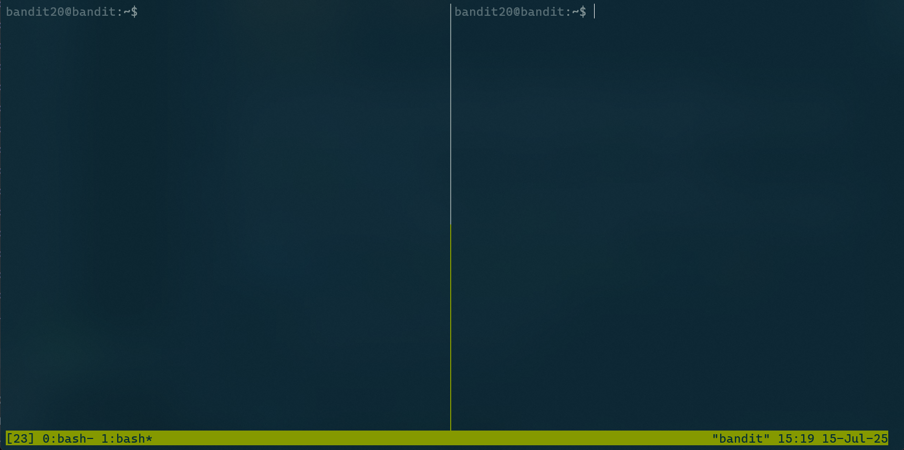

## Bandit Level 21 — Listener

### Description

There is a setuid binary in the homedirectory that does the following: it makes a connection to `localhost` on the port you specify as a commandline argument. It then reads a line of text from the connection and compares it to the password in the previous level (`bandit20`). If the password is correct, it will transmit the password for the next level (`bandit21`).


### Walkthrough

From the description we can guess we should setup our own listener.
Because we're working in a single SSH session, using `tmux` allows us to simulate multiple terminals. Just type `tmux` and this opens up a `tmux` session:

Now press `ctrl + b` and then `%` to split the terminal vertically:

Perfect! now we can navigate through each pane by pressing `ctrl + b` and then the arrow keys.

Back to our main task, we can setup a listener by this command `nc -lp <port>`. We want also another thing, our listener should send the current password to whoever connects:
```bash
bandit20@bandit:~$ echo "0qXahG8ZjOVMN9Ghs7iOWsCfZyXOUbYO" | nc -lp 6969
```
- `-l` — listen mode, for incoming connections

- `-p` — specifies the port to listen on

Now in the other pane, try connect to our listener port using the binary we are given:
```bash
bandit20@bandit:~$ ./suconnect 6969
Read: 0qXahG8ZjOVMN9Ghs7iOWsCfZyXOUbYO
Password matches, sending next password
```
We can see from the listener pane, we received a text:

```bash
bandit20@bandit:~$ echo "0qXahG8ZjOVMN9Ghs7iOWsCfZyXOUbYO" | nc -lp 6969
EeoULMCra2q0dSkYj561DX7s1CpBuOBt
```
And that is our password for the next level!

#### Note
Make sure you kill your `tmux` session before signing out. To do so you can press `ctrl + b` and then `d` to detach from the session. You can later kill the session by running `tmux kill-session`.
