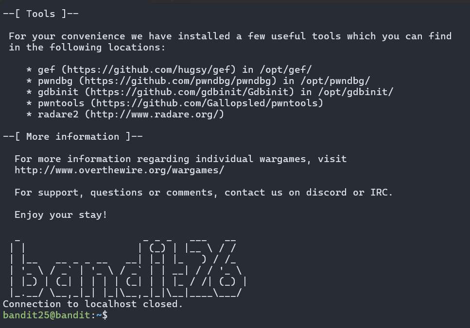
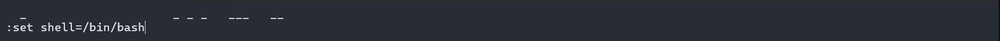
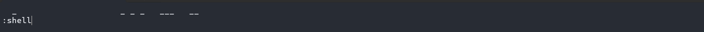
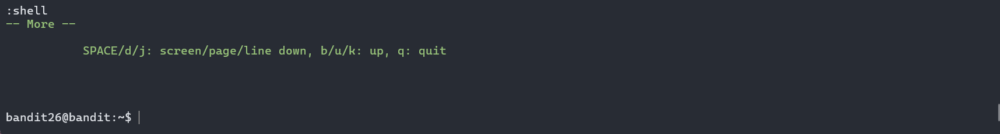

## Bandit Level 26 — More!

### Description

Logging in to `bandit26` from `bandit25` should be fairly easy… The shell for user `bandit26` is not `/bin/bash`, but something else. Find out what it is, how it works and how to break out of it.

**NOTE**: if you’re a Windows user and typically use Powershell to ssh into bandit: Powershell is known to cause issues with the intended solution to this level. You should use command prompt instead.

### Walkthrough

Let's see what we have in the current home directory:
```bash
bandit25@bandit:~$ ls
bandit26.sshkey
```
Nice we have `bandit26.sshkey`. We can connect to `bandit26` using this ssh key:
```bash
bandit25@bandit:~$ ssh bandit26@localhost -p 2220 -i bandit26.sshkey
```

Hmm we can't seem to connect to `bandit26`. Let's investigate further:

```bash
bandit25@bandit:~$ cat /etc/passwd | grep bandit26
bandit26:x:11026:11026:bandit level 26:/home/bandit26:/usr/bin/showtext
```
OK so the shell for user `bandit26` is `/usr/bin/showtext`. This is not a standard shell, so we need to find a way to break out of it.
Let's see the content of the `/usr/bin/showtext`:
```bash
bandit25@bandit:~$ cat /usr/bin/showtext
#!/bin/sh

export TERM=linux

exec more ~/text.txt
exit 0
```
It seems `showtext` is just a wrapper around `more` to display the contents of `~/text.txt`.
I searched to see any vulnerabilities in using `more`, it seems you can get a shell via entering the default text editor (in this level, most likely `vi`) and setting the default shell to our desired shell.
The key is to force the `more` to the *interactive mode* and pressing `v` to enter the text editor. You can achive this buy changing the size of you current terminal:

Entering the `vi`, press `esc` and type `:set shell=/bin/bash`:

Hit `enter` and again press `esc` and type `:shell`

And voila! We got the shell:

Just get the password and we're done:
```bash
bandit26@bandit:~$ cat /etc/bandit_pass/bandit26
s0773xxkk0MXfdqOfPRVr9L3jJBUOgCZ
```